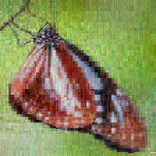

# Image Manipulation and Enhancement Application

## Overview

This project implements an **Image Manipulation and Enhancement Application** that performs various
operations on images, such as applying filters, transformations (like flipping and brightening), and
color manipulation. The design follows **Object-Oriented Programming principles** with an emphasis
on **modularity**, **scalability**, and the use of design patterns to apply filters and
transformations.

## How to Run the Application

### Using the JAR File (IME-v1.jar in the `res/` Folder)
The JAR file for this application is located in the `res/` folder and is named **`IME-v1.jar`**. You can run it in different modes based on your requirements.

- **Modes**:
    1. **Graphical User Interface (GUI)**:

    - **Command**: `java -jar IME-v1.jar`.
    - **Description**: Opens the application in GUI mode for interactive use.

    2. **Text-based Interactive Mode**:

    - **Command**: `java -jar IME-v1.jar -text`.
    - **Description**: Opens the application in text mode for line-by-line script execution.

    3. **Script Execution Mode**:

    - **Command**: `java -jar IME-v1.jar -file script`.
    - **Description**: Executes a script file and shuts down after processing.

---

## Example Outputs
<table>
  <tr>
    <th>Original</th>
    <th>Blurred</th>
    <th>Sharpened</th>
  </tr>
  <tr>
    <td></td>
    <td></td>
    <td></td>
  </tr>
  <tr>
    <th>Horizontal</th>
    <th>Vertical</th>
    <th>Image Compress</th>
  </tr>
  <tr>
    <td></td>
    <td></td>
    <td></td>
  </tr>
</table>

---

### MVC Structure

The application is structured using the **Model-View-Controller (MVC)** design pattern:

- **Model**: Handles the core logic and data manipulation of the images. This includes applying
  filters, transformations, and other operations. It is represented by classes such as
  `ImageProcessingModel`, `Pixel`, and various filters and transformations.
- **View**: Provides the user interface. In this case, `TextView` renders text-based output to the
  user.
- **Controller**: Coordinates the interaction between the user, the view, and the model. The
  `TextController` processes user commands and interacts with the model to perform the necessary
  operations.

This MVC design ensures separation of logic, making the system modular, easier to maintain, and
scalable for future enhancements.

## Class and Interface Overview

### `model.Pixel`

- **Purpose**: Represents a single pixel in an image. Each pixel has three components: `red`,
  `green`, and `blue`.

### `model.ImageData` (Interface)

- **Purpose**: Defines the structure for accessing and manipulating image data. The `ImageData`
  interface abstracts operations for retrieving and setting pixel values and managing image
  dimensions.
- **Key Methods**:
    - `getPixel(int x, int y)`: Retrieves the pixel at specified coordinates.
    - `setPixel(int x, int y, Pixel pixel)`: Sets the pixel at specified coordinates.
    - `getWidth()`, `getHeight()`: Returns the image's width and height.

### `model.ImageMatrix` (Implementation of `ImageData`)

- **Purpose**: Concrete implementation of the `ImageData` interface, storing pixel data in a 2D
  array. This class allows access to individual pixels and the ability to modify their RGB values.
  It provides dimensions of the image in terms of width and height.
- **Key Constructors**:
    - `ImageMatrix(int width, int height)`: Creates an empty image of specified width and height,
      initializing each pixel to black.
    - `ImageMatrix(Pixel[][] pixels)`: Constructs an `ImageMatrix` from a given 2D array of `Pixel`
      objects.
- **Copy Constructor**:
    - `ImageMatrix(ImageMatrix other)`: Constructs a deep copy of another `ImageMatrix`.

### `model.ImageProcessingModel`

- **Purpose**: Core class representing the image processing model. It holds the image data (as an
  instance of `ImageData`, typically `ImageMatrix`) and provides methods to apply filters and
  transformations to the image.
- **Key Methods**:
    - `applyFilter(Filter filter)`: Applies a filter to the image.
    - `flipHorizontal()`, `flipVertical()`: Flips the image horizontally and vertically.
    - `brighten(int factor)`: Adjusts brightness.
    - `rgbCombine()`, `rgbSplit()`: Handles splitting and combining RGB channels.
    - `compressImage` : Handles image compression.
    - `colorCorrect` : Applies color correction to the image.
    - `levelsAdjust` : Adjusts the levels of the image based on provided black, mid, and white
      points.

### `model.HistogramUtil`

- **Purpose**: Generates histogram of a given image.

### `model.filter.Filter` (Interface)

- **Purpose**: Represents a filter that can be applied to an image.

### `model.filter.TransformationFilter` (Abstract Class)

- **Purpose**: Provides common logic for filters that transform individual pixels.

### `model.filter.RedComponentFilter`, `BlueComponentFilter`, `GreenComponentFilter`

- **Purpose**: Filters that isolate the red, blue, or green components of each pixel.

### `model.filter.SepiaFilter`

- **Purpose**: Filter to convert an image to sepia tone.

### `model.filter.BlurFilter`, `SharpenFilter`

- **Purpose**: Convolution-based filters for blurring or sharpening an image.

### `model.transform.HorizontalFlip`, `VerticalFlip`

- **Purpose**: Transformations to flip the image horizontally or vertically.

### `model.transform.HaarWaveletCompression`

- **Purpose**: Handles image compression using Haar Wavelet compression technique.

### `model.intensity.Brighten`

- **Purpose**: Adjusts the brightness of the image.

### `model.color.RGBSplit`, `RGBCombine`

- **Purpose**: Handles splitting an image into red, green, and blue channels and combining them
  back.

### `controller.TextController`

- **Purpose**: Controls the flow of the application in a text-based environment. It processes user
  commands and interacts with the model.

### `view.ImageView`

- **Purpose**: Manages the graphical user interface, enabling user interactions for operations like
  downsizing, split percentage application, and mask-based manipulations.

### `controller.ImageController`

- **Purpose**: Handles user actions from the view, performs validation, and coordinates with the
  model for partial manipulations, downsizing, and filter applications.

### `view.TextView`

- **Purpose**: Handles the text-based user interface, rendering messages to the user.

### `util.ImageUtil`

- **Purpose**: Provides helper methods for loading and saving images in different formats (PPM, JPG,
  PNG).

---

## Design Patterns

- **Strategy Pattern**: Used to apply filters to images. The `Filter` interface defines a common
  strategy for all filters.
- **Modularity**: Operations like flipping, filtering, and brightening are encapsulated in separate
  classes to ensure the system is easy to extend and maintain.

## How to Run Commands in Text Mode

Example commands:
    - `load res/sample.jpg sample`
    - `save res/sample.png sample`
    - `red-component sample sample-red`
    - `blur sample sample-blur`
    - `run res/script_file`

---

## Conclusion

This project implements a flexible, scalable image manipulation system using good Object-Oriented
Design principles. Each class and interface plays a distinct role, making the system easy to extend
with new filters and transformations.

## Image Source and Citation

The image(s) used in this project come from the following source:

- **Image Source**: https://www.kaggle.com/datasets/phucthaiv02/butterfly-image-classification.
- **Usage Terms**: This image is licensed under **CC0: Public Domain**, allowing for public use.
